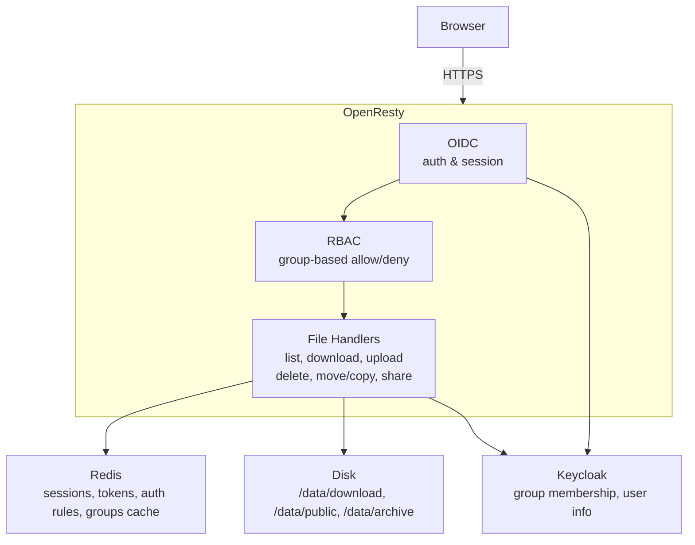

# iDO-Files

A self-hosted file server with a web UI — browse, download, upload, delete, and share files. Built on OpenResty (nginx + Lua) with Redis-backed state and OIDC authentication.

> **TODO: Add screenshots**
> - Main file listing (light mode)
> - Dark mode
> - Context/action menu on a file
> - Share link or admin page

## Features

- **Browse & manage files** — list directories, download files, upload via drag-and-drop, create folders, rename, delete, move/copy
- **Three storage buckets** — `download/`, `public/`, `archive/` with independent access control
- **OIDC authentication** — sign in with Keycloak (or any OpenID Connect provider), with optional guest access on public paths
- **RBAC authorization** — JSON rules file maps groups to allowed/denied HTTP methods and path prefixes
- **Share links** — generate time-limited shareable download links (configurable expiry, max 1 year)
- **API tokens** — per-user bearer tokens for programmatic access
- **App install manifests** — time-limited tokens for `.ipa`/`.hap`/`.app` install flows
- **Concurrent download limits** — per-user rate limiting with configurable burst and delay
- **Dark mode** — theme toggle persisted in localStorage
- **Code viewer** — inline syntax highlighting for source files
- **Search & sort** — client-side filtering and column sorting in the file listing
- **Housekeeping** — automated file cleanup with configurable retention rules (keep count, keep days), dry-run mode, and a tree-based admin UI
- **Internal endpoints** — `/internal-download/` and `/internal-archive/` bypass authentication for service-to-service access
- **Mobile-friendly** — responsive UI built with Bootstrap

## Quick Start

### Docker

```bash
docker run -d \
  --name ido-files \
  -p 8080:80 \
  -v /path/to/data:/data \
  -e REDIS_HOST=redis \
  -e REDIS_PASSWORD=fileserver \
  -e AUTH_REQUIRED=false \
  -e LOGO_TEXT="My Files" \
  -e URL_PREFIX=/ \
  docker.io/xinnj/file-server:latest
```

Open http://localhost:8080/ in your browser.

### Kubernetes (Helm)

```bash
# Clone and install with defaults (includes Redis)
helm install file-server ./charts \
  --set env[0].value=/myteam
```

Or create a `values.yaml` override:

```yaml
env:
  - name: URL_PREFIX
    value: /myteam
  - name: AUTH_REQUIRED
    value: "true"
  - name: OIDC_DISCOVERY_URL
    value: https://keycloak.example.com/realms/myrealm
  - name: OIDC_CLIENT_ID
    value: fileserver
  - name: OIDC_CLIENT_SECRET
    value: <secret>

ingress:
  enabled: true
  hosts:
    - host: files.example.com
      paths:
        - path: /myteam
          pathType: ImplementationSpecific

persistence:
  enabled: true
  size: 50Gi
```

Then install:

```bash
helm install file-server ./charts -f values.yaml
```

## Configuration

All configuration is via environment variables.

| Variable | Default | Description |
|---|---|---|
| `URL_PREFIX` | `/` | Sub-path prefix when serving behind a reverse proxy (e.g. `/myteam`) |
| `LOGO_TEXT` | `My Files` | Text displayed in the navbar |
| `PAGE_LIMIT` | `25` | Files per page in directory listings |
| `AUTH_REQUIRED` | `false` | Require authentication (`true`/`false`) |
| **OIDC** | | |
| `OIDC_DISCOVERY_URL` | — | OpenID Connect discovery URL (e.g. `https://keycloak.example.com/realms/myrealm`) |
| `OIDC_CLIENT_ID` | — | OIDC client ID |
| `OIDC_CLIENT_SECRET` | — | OIDC client secret |
| `OIDC_REDIRECT_URI` | — | OIDC redirect URI (defaults to `$scheme://$host:<URL_PREFIX>/redirect_uri`) |
| `OIDC_LOGOUT_PATH` | — | Logout path (defaults to `<URL_PREFIX>/logout`) |
| `OIDC_LOGOUT_REDIRECT_URI` | — | Post-logout redirect |
| `OIDC_SSL_VERIFY` | `yes` | Verify OIDC provider SSL certificate |
| **Redis** | | |
| `REDIS_HOST` | `redis` | Redis host |
| `REDIS_PORT` | `6379` | Redis port |
| `REDIS_PASSWORD` | — | Redis password |
| **RBAC** | | |
| `ADMIN_GROUP` | `/fileserver_admin` | Keycloak group granted full admin access |
| `GROUPS_CACHE_TTL` | `300` | User group membership cache TTL in seconds |
| **Tokens** | | |
| `TOKEN_EXPIRE_MINUTES` | `6` | API token default expiry in minutes |
| **Concurrent control** | | |
| `ENABLE_CONCURRENT_CONTROL` | `true` | Enable per-user download concurrency limiting |
| `MAX_CONCURRENT_DOWNLOADS` | `5` | Max concurrent downloads per user |
| `CONCURRENT_BURST` | `2` | Burst allowance above the limit |
| `CONCURRENT_DELAY` | `1` | Delay in seconds when limit is exceeded |

## Storage Buckets

Data lives under `/data/<URL_PREFIX>/` with three buckets:

| Bucket | Path | Auth | Purpose |
|---|---|---|---|
| `download` | `/data/<URL_PREFIX>/download` | Required (when `AUTH_REQUIRED=true`) | Private files — core storage |
| `public` | `/data/<URL_PREFIX>/public` | Optional (guest fallback) | Publicly accessible files |
| `archive` | `/data/<URL_PREFIX>/archive` | Required (when `AUTH_REQUIRED=true`) | Archived/read-only storage |

A symlink `app → download` is created at startup, so `/app/` serves the same content as `/download/`.

Two internal endpoints (`/internal-download/`, `/internal-archive/`) bypass authentication for service-to-service access.

## Authentication & Authorization

### OIDC

When `AUTH_REQUIRED` is `true`, users are redirected to the configured OIDC provider for login. After authentication, the user's groups are fetched from Keycloak via its Admin API and cached in Redis.

The `public/` bucket uses a softer check — it attempts to resolve the session but falls back to guest access if no valid session exists.

### RBAC Rules

Authorization rules are stored in `/data/config/auth_config.json` and persisted to Redis. Rules map Keycloak groups to allowed/denied operations:

```json
{
  "version": 1,
  "rules": {
    "/.default": {
      "allow": [],
      "deny": []
    },
    "/fileserver_admin": {
      "allow": [
        "all:<URL_PREFIX>download",
        "all:<URL_PREFIX>archive",
        "all:<URL_PREFIX>public"
      ],
      "deny": []
    }
  }
}
```

- Rules follow the format `operation:path_prefix` (e.g. `GET:<URL_PREFIX>download/file.txt`, `all:<URL_PREFIX>download`)
- Deny rules take priority over allow rules
- The special group `/.default` applies to all authenticated users
- Rules can be managed from the admin UI (`/access-control`)

### API Tokens

Users can create personal API tokens from the UI (`/access-token`). Tokens are stored per-user in Redis and accepted as Bearer tokens. Admins can manage all tokens.

### Share Links

Time-sensitive share links are created from the file context menu. Each link is a unique token stored in Redis with configurable expiry (up to 1 year). Access is at `/share/<token>`.

## Development

### Prerequisites

- OpenResty (or nginx with `lua-nginx-module`, `ngx_devel_kit`)
- Lua 5.1 with luarocks
- Redis
- [busted](https://olivinelabs.com/busted/) (for tests)

### Running tests

```bash
LUA_PATH="./lua/?.lua;./lua/?/init.lua;./lua/tests/?.lua;" busted lua/tests/
```

Tests use a mock `ngx` global defined in `lua/tests/mock_ngx.lua`.

### Building the Docker image

```bash
./build.sh <tag>
```

This builds the base OpenResty image (`Dockerfile-base`) first, then the application image (`Dockerfile`).

## Architecture



Key Lua modules live under `lua/` — `handler.lua` (core request handling), `authorize.lua` (RBAC), `oidc.lua` (authentication), `keycloak.lua` (group resolution), plus modules for tokens, uploads, file operations, and concurrency control.

## CI/CD

- **Tests** — E2E tests (Playwright) run on every push to `main` and all PRs, spinning up OpenResty + Redis to verify the full stack.
- **Release** — On published releases: builds the Docker image (version tag + `latest`), pushes to Docker Hub, packages the Helm chart, and attaches it to the release.

## License

[Apache License 2.0](LICENSE)
